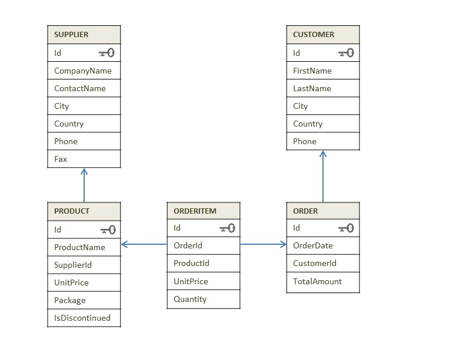
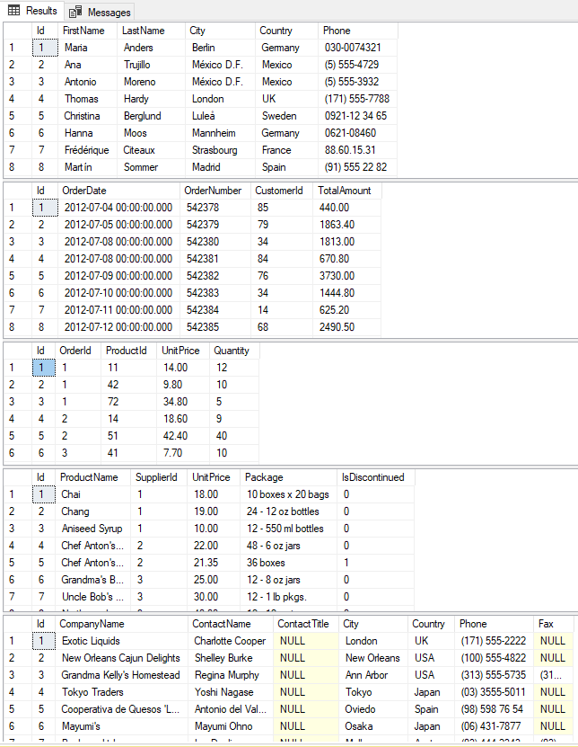
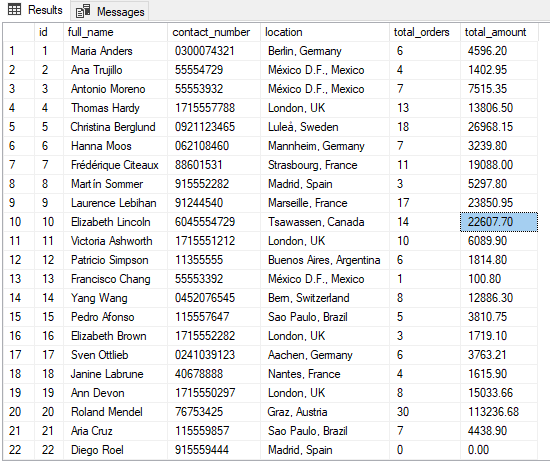
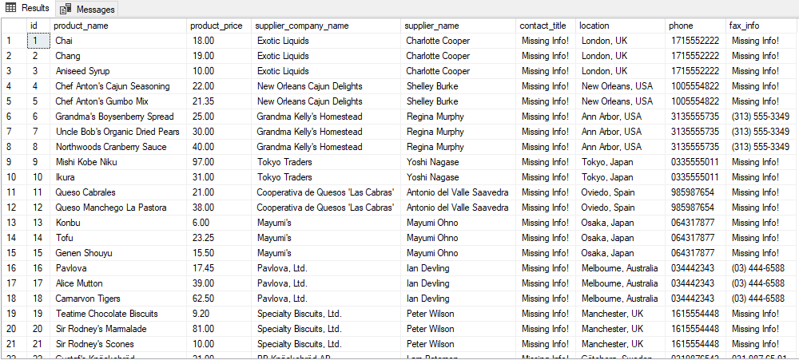

# This repository contains my own ETL and data analysis project 
# Queries to create database downloaded from "https://www.dofactory.com/sql/sample-database"
# Belows is the Schema of the testing database

# Below are the Customer,Order,Orderitem,product and supplier tables in MSSQL server

# Below is the first customer_orders table loaded in the testing2 database
# this table has merged first and last name, city and country to location and has retrieved total number of orders and total amount

# Below product_info table created in testing2 database

